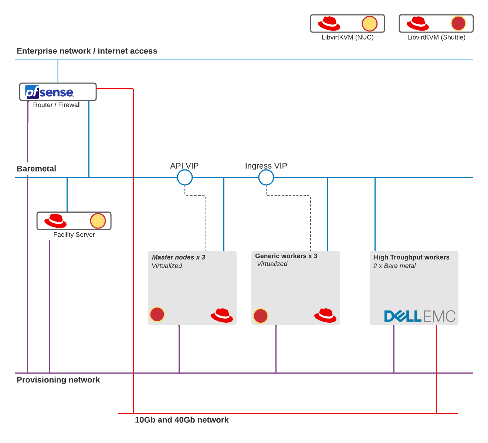

# 5glab-revised-2021
OpenShift 4 BareMetal deploy focused on NFV - ,M4r1k's gear integrated with Zokahn gear, seeing what makes sense in terms of what keep and what to sell. Use-cases, power consumption, network throughput, deployment mechanism.

The lab runs in my shed, at my house. It is integrated in my home network and impacts my energy bill and my gadget budget ;-) In my work for Red Hat i am assigned to project at our Telecom customers. My drive is to learn, in depth, on how the Red Hat technology is used and is best implemented at Telco customers. Mainly to calm my nerves and be well prepared and while i do that power the increase of knowledge and experience of the wider Red Hat Services organization in a to be formed OpenShift for Infra focused folks.

The scope of this group is still being defined but focus is on:
- How demanding workloads in terms of performance work well on OpenShift
- How specific hardware features are exposed to workloads running in pods
- How networking technologies are offered to workloads
- What typical infrastructure focused tools and services are helpful around OpenShift 4 implementations
- Result of the work is funneled into articles, ansible automation in git repositories.

## Minimal Viable product

- Network
  - Implement the required VLANs (baremetal and provisioning)
  - Assemble them in a central router with firewall capability
  - OCP4 DHCP and DNS requirements implemented
  - OpenShift base L1 networks implemented on 1Gbps on low power small business grade network fabric (netgear)
  - OpenShift payload networks on high performance 10G and 40G fabric (Brocade)
- Compute
  - Generic OCP4 components (facility node, masters, workers) hosted on consumer grade hosts, low power profile (Intel NUC and Shuttle XPC cube SH370R8)
  - High(er) performance OCP4 workers implemented on Dell PowerEdge rack servers with 10g and 40g NICs
- Storage
  - Local disks for Everything
    - iscsi or NFS shares via VM's
  - A Synology with spinning disks to provide some shared storage

## Welcome to Telco Containerized Network Functions
Many Telcos are moving to containerized architectures and ditching for good the legacy, which historically is built on layers of proprietary and specialized solutions.

During the past decade, many Telcos have looked at OpenStack for their 4G Virtualized Network Functions needs as the solution for the NFVi. While many succeeding *and also some failing*, OpenStack was never truly build to orchestrate containers. Put that together with the [community's current status](https://www.theregister.com/2020/10/22/openstack_at_10/), you'll get that 5G represents an opportunity to do things differently and hopefully better.

The 5G standard allows decoupling the various components into literally thousands of micro-services to embrace a containerized architecture. The following diagram represents the mobile network (2G, 3G, 4G, 5G ) ([available on NetX](https://www.mpirical.com/netx), IMO best independent source to learn the 3GPP mobile standards)


Even considering only 5G, orchestrating these massive applications without something like Kubernetes would be impossible.


## 5G OpenShift cluster as designed by m4r1k
The base project no longer continued: https://github.com/m4r1k/k8s_5g_lab

Zokahn was able to acquire the 5G lab from m4r1k. Steps were made to save energy and to integrate the existing lab towards new use-cases:

- Re-implement fully with Libvirt virtualization ditching VMware
- Implement a MachineSet for the baremetal workers to have them scale to turn on and switch off again when not needed.
- Deploy all the required components with the focus on making it work
- Add various extensions of OpenShift 4 specific for 5G Telco with
  - MachineConfig
  - Multus in various mode (network attachments, macvlan, complete nic)
  - NMState
  - SR-IOV
  - MetalLB
  - PAO Operator

*) coming soon


### Todo or not a focus for now
- Local storage on workers for now

In the near future the following topics will also be covered

  - FD.IO VPP App
  - Use an external CA for the entire platform
  - MetalLB BGP
  - Contour
  - CNV
  - Rook

  - Run some test-cases in separate blog articles*
    - Network Policies
    - Air gapped installation
    - Troubleshooting and Testing

## 2 - 5G is Containers
From [Ericsson](https://www.ericsson.com/en/cloud-native) to [Nokia](https://www.nokia.com/blog/containers-and-the-evolving-5g-cloud-native-journey/), from [Red Hat](https://www.redhat.com/en/blog/5g-core-adoption-open-way-red-hat-openshift?source=bloglisting&page=1&search=5g+openshift) to [VMware](https://www.fiercewireless.com/tech/samsung-vmware-team-cloud-native-5g-functions), and with leading examples like [Verizon](https://www.fiercewireless.com/tech/verizon-readies-initial-shift-to-5g-standalone-core-after-successful-trial) and [Rakuten](https://www.fiercewireless.com/5g/rakuten-s-5g-network-will-be-built-containers), there is absolutely no douth that 5G means containers, and as everybody knows, containers mean Kubernetes. There are many debates whether the more significant chunk of the final architecture would be virtualized or natively running on bare-metal (there are still some cases where hardware virtualization is a fundamental need) but, in all instances, Kubernetes is the dominant and de-facto standard to build applications.

Operating in a containerized cloud-native world represents such a significant shift for all Telco operators that the NFVi LEGO approach seems easy now.

For those who have any doubts about the capability of Kubernetes to run an entire mobile network, I encourage you to watch:

* [KubeCon NA 2019 Keynote](https://www.youtube.com/watch?v=IL4nxbmUIX8) - [Slides](https://static.sched.com/hosted_files/kccncna19/c9/5%20HEATHER%20KIRKSEY%20-%20V3.pptx.pdf)
* [Build Your Own Private 5G Network on Kubernetes](https://www.youtube.com/watch?v=R_JOhWlwsXo) - [Slides](https://static.sched.com/hosted_files/kccncna19/02/KubeCon%202019%20-%20BYO%205G%20Network.pdf)

### 2.1 - Why Bare-metal?
To answer this question, you need to keep in mind the target workloads: Cloud-native Network Function (CNF) such as UPF for 5G Core and vDU in RAN. [Red Hat has a great whitepaper](https://www.redhat.com/en/resources/optimize-5g-with-containers-on-bare-metal-whitepaper) talking about all the details, especially how performance is negatively affected by a hardware virtualization layer. [Yet other examples from Red Hat](https://www.redhat.com/en/blog/red-hat-openshift-drives-strong-5g-open-ran-ecosystem) in the [Radio context](https://www.redhat.com/en/blog/kubernetes-bare-metal-future-ran). But if Red Hat is not enough, well, [let's look at Ericsson](https://www.ericsson.com/en/blog/2020/3/benefits-of-kubernetes-on-bare-metal-cloud-infrastructure) talking about the advantages of cloud-native on bare-metal.

### 2.2 - Why Virtual?
The masters and a basic set of workers are implemented as virtual machines. This to host cost effective and save electrical energy. These virtual machines all run on the same host defeating the whole reason to run multiple masters and workers; when the virt host goes down, so do the masters and the workers.
However, testing concepts is MUCH faster with the limited time boot sequences take compared to HPE and Dell bios initialization.
Virtual hardware is also extremely adjustable and easy to setup using scripts. Try 'racking' and 'cabling' six bare metal machines with some bash scripting ;-)

### 2.3 A healthy repeatable mix of choices for a lab
This lab showcases some features of OpenShift for Telco but for sure compromises on design elements. As with any Telco implementation this lab has its focus on networking.
Focus is also on installing OpenShift showing the technical steps needed in most OpenShift installations geared towards high performance network focused workloads.

**<div align="center"><span style="color:red">For the sake of explanation, limited automation is provided</span></div>**

# 3 High Level design
This design is created with a few ideas in mind. Make best use of 'low power' and 'high power' network and compute resources. This means that some of these components are always on, mostly consumer grade network and low power but spec'd out computers. Only on for doing throughput and configuration tests are Telco grade switches and 19" bare metal machines with high performance storage controllers, IPMI/idrac and LOTS of memory and disks.

Networks are not just routed, they connect via Pfsense. This gives the best possible replication of real world Telecom operator implementations. Not only is there a lot of network segregation, but all connecting networks are filtered and only intended traffic is whitelisted.

Virtual where we can but physical where needed. When going into the High Throughput workers we run them on the Dell servers which hold NIC's capable of doing 20G+ throughtput via the Brocade switches. These components, while idle, take 500 watts of electricity.

In the previous designs from M4r1k there was heavy use of VMware. I aint've time for that ;-) My comfort zone is in Libvirt/KVM, not only running virtual machines but also mangling images and quickly deploying, integration with [Guacamole](http://www.simpletest.nl/wordpress/2021/03/28/rdp-vnc-to-html5-proxy-guacamole/) and my other tools.



# 4 Technical implementation

## 4.1 Meet the hardware

### 4.1.1 Servers

| Role | Hardware | CPU | Mem | Disk | NIC1 | NIC2 |   |
|------|----------|-----|-----|------|------|------|---|
| Libvirt host | [Intel NUC NUC7i5BNK](https://ark.intel.com/content/www/us/en/ark/products/95061/intel-nuc-kit-nuc7i5bnk.html) | i5-7260U | 32Gb | 1Tb nvme SSD | eno1 TRUNK |      |   |
| Libvirt host | [Shuttle SH370R8](https://tweakers.net/pricewatch/1320758/shuttle-xpc-cube-sh370r8.html) | i7-9700K | 128Gb | 1Tb nvme SSD |  enp1s0 TRUNK |      |   |
|      |          |     |     |      |      |      |   |

The Shuttle system is remarkable. It holds 128Gb of normal DDR4 memory modules. Which is still a sizable investment but A LOT of value for money in a quiet, energy efficient system (compared to Dell or HPE rack servers).
Together with the NVMe drive, the possible addition of a PCIe

### 4.1.2 Switches

## 4.2 Networks

### 4.2.1 IP planning

# 5 Walk through
These are the steps to deploy everything that is needed to deploy OpenShift, followed by the OpenShift deployment commands. OpenShift is Open Source software, as i work for Red Hat can work with the subscription based versions. Without too many chances this can be made to work with a CentOS(ish) OS and [OKD](https://www.okd.io/).

## 5.1 RHEL8 OS implementation on NUC and Shuttle
The base, minimal installation of RHEL8 should be performed on the two libvirt hosts NUC and Shuttle. The register with subscription manager and activated with the base channels. Then some networking should be arranged to allow VM's to connect via Linux Bridging.

### 5.1.1 Base installation
The base installation was performed on both machines with a USB thumbdrive as the machines lack remote media options. The following are the resulting kickstart files.

The disk layout is as simple as possible, having most of the disk capacity available via the root / filesystem. This is to have a central directory where the virtual machines are spawned.

[NUC kickstart file](notes/nuc.ks)
[Shuttle kickstart file](notes/shuttle.ks)

### 5.1.2 Registering and attaching RPM repositories

```
export USER=<username>
export PASS=<password>
subscription-manager register --user $USER --password $PASS  --auto-attach

subscription-manager repos --disable=*

subscription-manager repos --enable=rhel-8-for-x86_64-baseos-rpms --enable=rhel-8-for-x86_64-appstream-rpms
```

### 5.1.3 Installing updates, libvirt and nice to haves

```
yum -y update
systemctl disable --now firewalld

yum -y install libvirt-devel virt-top libguestfs-tools
systemctl enable --now libvirtd

yum -y install cockpit
systemctl enable --now cockpit.socket
```
## 5.2 Facility server base installation

## 5.3 Deploying skeleton Virtual Machines and vBMC ipmi

## 5.4 Implementing network requirements

## 5.5 Deploying OpenShift 4 IPI

## 5.6 Adding BM workers

## 5.7 High Throughput networks
